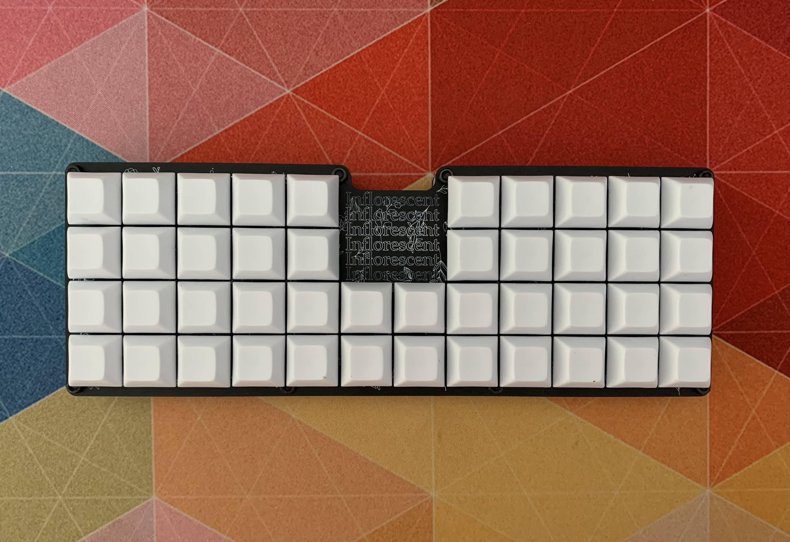
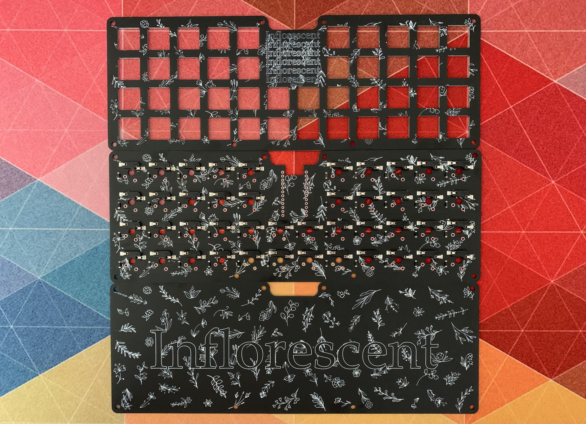

# Inflorescent

Inflorescent is a 40% flowerstatic PCB keyboard made with KiCAD.

This repo has three folders:
- mCAD
- eCAD
- QMK

The mCAD Folder contains STLs for the spacer. There are two types of spacers, standard and complete. These can be 3D printed and either can be used.

The eCAD folder contains the three PCBs that make up the Inflorescent keyboard. The base, mainboard (inflorescent board) and plate. The base and plate are just PCBs whilst the inflorescent board contains the pads and PTH for mounting switches, Kailh hot-swappable sockets and a microcontroller. If you would like to make one your self you can generate the gerbers and have them made yourself. The recommended microcontroller is an Elite C but any Pro Micro equivalent should work. 

The QMK folder contains the files for the QMK firmware. You can compile it your self with QMK or you can flash the firmware.hex with QMK Toolbox. Just select the firmware.hex and atmega32u4 as the MUC.

## TODO 

Move mounted holes so they don't collide with the keys.
Change switch footprint to allow for 5 pin switches.

## Pictures

